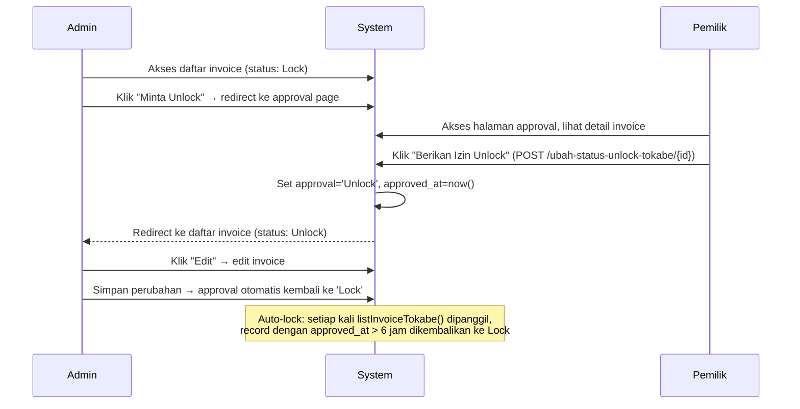
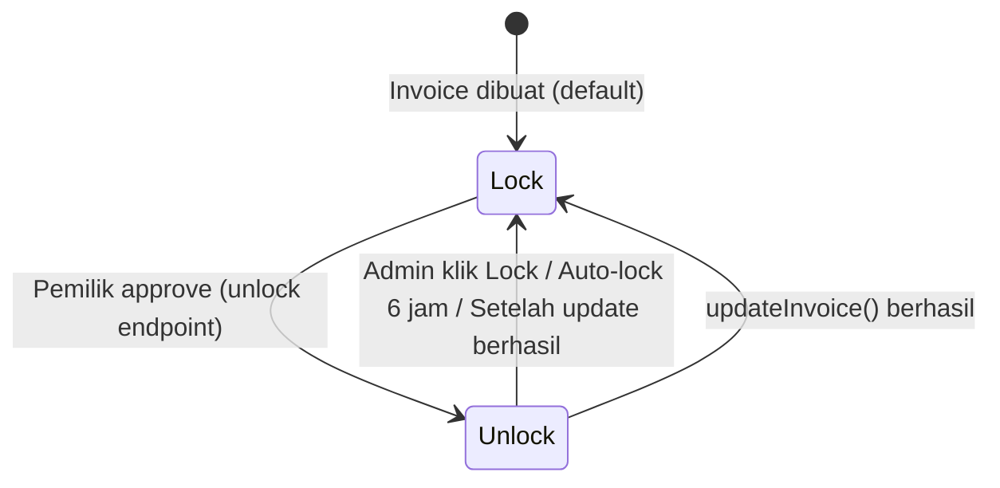

# Design Document — Tokabe Approval & Pelunasan

## Overview

Fitur ini menerapkan mekanisme **Approval & Pelunasan** pada Invoice Tokabe, mengikuti pola yang sudah berjalan di Invoice Ibekami. Saat ini Admin dapat langsung mengubah status invoice Tokabe tanpa izin Pemilik. Fitur ini menambahkan:

1. Kolom `approval` dan `approved_at` pada tabel `penjualan_tokabe`
2. Alur lock/unlock berbasis persetujuan Pemilik dengan auto-lock 6 jam
3. Halaman approval khusus Pemilik untuk memberikan izin unlock
4. Halaman pelunasan khusus Pemilik untuk memproses status Lunas/Batal
5. Pembaruan UI pada daftar invoice dan halaman edit

Implementasi ini mereplikasi mekanisme yang sudah ada di `InvoiceController` dan tabel `penjualan` ke dalam `PenjualanTokabeController` dan tabel `penjualan_tokabe`.

---

## Architecture

### Alur Kerja Lock → Unlock → Edit → Auto-lock



### State Machine Invoice Approval



### Komponen yang Terlibat

```
routes/web.php
    └── 6 route baru (tokabe.unlock, tokabe.lock, tokabe.approval.page,
                       tokabe.pelunasan.page, tokabe.status.batal, tokabe.status.lunas)

PenjualanTokabeController
    ├── listInvoiceTokabe()     [MODIFIED] — tambah auto-lock logic
    ├── updateInvoice()         [MODIFIED] — tambah auto-lock setelah update
    ├── unlock($id)             [NEW]
    ├── lock($id)               [NEW]
    ├── approvalPage($id)       [NEW]
    ├── pelunasanPage($id)      [NEW]
    ├── statusLunas($id)        [NEW]
    └── storeStatusBatal($req, $id) [NEW]

PenjualanTokabe (Model)
    └── $fillable               [MODIFIED] — tambah approval, approved_at

database/migrations/
    └── xxxx_add_approval_to_penjualan_tokabe.php [NEW]

resources/views/pages/invoices/tokabe/
    ├── daftar-invoiceTokabe.blade.php  [MODIFIED] — tambah badge & tombol
    ├── edit-invoicesTokabe.blade.php   [MODIFIED] — tambah guard approval
    ├── approval.blade.php              [NEW]
    └── pelunasan.blade.php             [NEW]
```

---

## Components and Interfaces

### 1. Migration

File: `database/migrations/YYYY_MM_DD_HHMMSS_add_approval_to_penjualan_tokabe.php`

```php
public function up(): void
{
    Schema::table('penjualan_tokabe', function (Blueprint $table) {
        $table->string('approval')->default('Lock')->nullable()->after('sisa_pembayaran');
        $table->timestamp('approved_at')->nullable()->after('approval');
    });
}

public function down(): void
{
    Schema::table('penjualan_tokabe', function (Blueprint $table) {
        $table->dropColumn(['approval', 'approved_at']);
    });
}
```

### 2. Model — PenjualanTokabe

Tambahkan `approval` dan `approved_at` ke `$fillable`:

```php
protected $fillable = [
    // ... kolom yang sudah ada ...
    'approval',
    'approved_at',
];
```

### 3. Controller — PenjualanTokabeController

#### Method Baru: `unlock($id)`

```php
public function unlock($id)
{
    $inv = PenjualanTokabe::find($id);
    if (!$inv) {
        Alert::error('Data tidak ditemukan');
        return redirect()->back();
    }
    $inv->approval = 'Unlock';
    $inv->approved_at = now();
    $inv->save();
    Alert::success('Invoice Tokabe berhasil di-Unlock');
    return redirect()->route('list_invoice_tokabe');
}
```

#### Method Baru: `lock($id)`

```php
public function lock($id)
{
    $inv = PenjualanTokabe::find($id);
    if (!$inv) {
        Alert::error('Data tidak ditemukan');
        return redirect()->back();
    }
    $inv->approval = 'Lock';
    $inv->approved_at = null;
    $inv->save();
    Alert::success('Invoice Tokabe berhasil di-Lock');
    return redirect()->back();
}
```

#### Method Baru: `approvalPage($id)`

```php
public function approvalPage($id)
{
    $invoice = PenjualanTokabe::findOrFail($id);
    $penjualan_barang = PenjualanJasaTokabe::where('penjualan_id', $id)->get();
    $invoice->formatted_total_pembayaran = number_format($invoice->total_pembayaran, 0, ',', '.');
    $barang = [];
    foreach ($penjualan_barang as $item) {
        $barang[] = Barang::where('id', $item->barang_id)->get();
    }
    return view('pages.invoices.tokabe.approval', compact('invoice', 'penjualan_barang', 'barang'));
}
```

#### Method Baru: `pelunasanPage($id)`

```php
public function pelunasanPage($id)
{
    $invoice = PenjualanTokabe::findOrFail($id);
    $penjualan_barang = PenjualanJasaTokabe::where('penjualan_id', $id)->get();
    $invoice->formatted_total_pembayaran = number_format($invoice->total_pembayaran, 0, ',', '.');
    $invoice->formatted_sisa_pembayaran = number_format($invoice->sisa_pembayaran, 0, ',', '.');
    $barang = [];
    foreach ($penjualan_barang as $item) {
        $barang[] = Barang::where('id', $item->barang_id)->get();
    }
    return view('pages.invoices.tokabe.pelunasan', compact('invoice', 'penjualan_barang', 'barang'));
}
```

#### Method Baru: `statusLunas($id)`

```php
public function statusLunas($id)
{
    $inv = PenjualanTokabe::find($id);
    if (!$inv) {
        Alert::error('Data tidak ditemukan');
        return redirect()->back();
    }
    $inv->status = 'Lunas';
    $inv->sisa_pembayaran = 0;
    $inv->save();
    Alert::success('Invoice Tokabe Sudah Lunas');
    return redirect()->route('list_invoice_tokabe');
}
```

#### Method Baru: `storeStatusBatal(Request $request, $id)`

```php
public function storeStatusBatal(Request $request, $id)
{
    $invoice = PenjualanTokabe::findOrFail($id);
    $invoice->status = 'Batal';
    $invoice->alasan_batal = $request->alasan_batal;
    $invoice->save();
    return redirect()->back()->with('batal', 'Invoice Tokabe berhasil dibatalkan.');
}
```

#### Modifikasi: `listInvoiceTokabe()` — Tambah Auto-lock

Tambahkan blok berikut di awal method, sebelum query data:

```php
DB::table('penjualan_tokabe')
    ->where('approval', 'Unlock')
    ->whereNotNull('approved_at')
    ->where('approved_at', '<', now()->subHours(6))
    ->update(['approval' => 'Lock', 'approved_at' => null]);
```

#### Modifikasi: `updateInvoice()` — Auto-lock Setelah Update

Tambahkan setelah `$penjualan->save()` berhasil:

```php
$penjualan->approval = 'Lock';
$penjualan->approved_at = null;
$penjualan->save();
```

### 4. Routes

Tambahkan di dalam `Route::group(['middleware' => ['admin']])` di `routes/web.php`:

```php
// TOKABE APPROVAL & PELUNASAN
Route::post('/ubah-status-unlock-tokabe/{id}', [PenjualanTokabeController::class, 'unlock'])
    ->name('tokabe.unlock');
Route::get('/ubah-status-lock-tokabe/{id}', [PenjualanTokabeController::class, 'lock'])
    ->name('tokabe.lock');
Route::get('/tokabe-approval/{id}', [PenjualanTokabeController::class, 'approvalPage'])
    ->middleware('auth', 'role:Pemilik')
    ->name('tokabe.approval.page');
Route::get('/tokabe-pelunasan/{id}', [PenjualanTokabeController::class, 'pelunasanPage'])
    ->middleware('auth', 'role:Pemilik')
    ->name('tokabe.pelunasan.page');
Route::post('/ubah-status-batal-tokabe/{id}', [PenjualanTokabeController::class, 'storeStatusBatal'])
    ->name('tokabe.status.batal');
Route::post('/ubah-status-lunas-tokabe/{id}', [PenjualanTokabeController::class, 'statusLunas'])
    ->name('tokabe.status.lunas');
```

### 5. Views

#### `approval.blade.php` (baru)

Mengikuti struktur `pages/invoices/approval.blade.php` Ibekami, dengan penyesuaian:
- Judul: "Konfirmasi Approval Invoice Tokabe"
- Form action: `route('tokabe.unlock', $invoice->id)`
- Link kembali: `route('list_invoice_tokabe')`
- Loop item menggunakan `$jual->harga` (bukan `$jual->hargaBarang`) karena kolom di `penjualan_jasa_tokabe` bernama `harga`

#### `pelunasan.blade.php` (baru)

Mengikuti struktur `pages/invoices/pelunasan.blade.php` Ibekami, dengan penyesuaian:
- Judul: "Konfirmasi Pelunasan Invoice Tokabe"
- Form action Lunas: `route('tokabe.status.lunas', $invoice->id)`
- Form action Batal: `route('tokabe.status.batal', $invoice->id)` dengan input `alasan_batal`
- Tampilkan sisa pembayaran: `$invoice->formatted_sisa_pembayaran`
- Link kembali: `route('list_invoice_tokabe')`

#### `daftar-invoiceTokabe.blade.php` (modifikasi)

Tambahkan kolom "Approval" di tabel, dan modifikasi dropdown aksi:

```blade
{{-- Badge status approval --}}
@if($inv->approval == 'Unlock')
    <span class="badge badge-soft-success p-2">Unlock</span>
@else
    <span class="badge badge-soft-warning p-2">Lock</span>
@endif

{{-- Tombol aksi kondisional --}}
@if($inv->approval == 'Unlock')
    {{-- Tombol Edit aktif --}}
    <a class="dropdown-item" href="{{ route('edit.inv.tkb', $inv->id) }}">
        <i class="las la-pen fs-18 align-middle me-2 text-muted"></i>Edit
    </a>
    {{-- Tombol Lock --}}
    <a class="dropdown-item" href="{{ route('tokabe.lock', $inv->id) }}">
        <i class="las la-lock fs-18 align-middle me-2 text-warning"></i>Lock
    </a>
@else
    {{-- Tombol Minta Unlock --}}
    <a class="dropdown-item" href="{{ route('tokabe.approval.page', $inv->id) }}">
        <i class="las la-unlock fs-18 align-middle me-2 text-primary"></i>Minta Unlock
    </a>
@endif

{{-- Tombol Pelunasan (hanya Pemilik, hanya Belum Lunas) --}}
@if(Auth::user()->role === 'Pemilik' && $inv->status == 'Belum Lunas')
    <a class="dropdown-item" href="{{ route('tokabe.pelunasan.page', $inv->id) }}">
        <i class="las la-money-bill fs-18 align-middle me-2 text-success"></i>Pelunasan
    </a>
@endif
```

#### `edit-invoicesTokabe.blade.php` (modifikasi)

Tambahkan guard di awal section content:

```blade
@if($inv->approval == 'Lock')
    <div class="alert alert-warning">
        <i class="las la-lock me-2"></i>
        Invoice ini sedang terkunci. Silakan minta Pemilik untuk memberikan izin unlock terlebih dahulu.
        <a href="{{ route('tokabe.approval.page', $inv->id) }}" class="alert-link">Minta Unlock</a>
    </div>
@endif
```

---

## Data Models

### Tabel `penjualan_tokabe` — Kolom Baru

| Kolom | Tipe | Default | Nullable | Keterangan |
|-------|------|---------|----------|------------|
| `approval` | string | `'Lock'` | Ya | Status kunci invoice: `'Lock'` atau `'Unlock'` |
| `approved_at` | timestamp | `null` | Ya | Waktu invoice di-unlock; dikosongkan saat di-lock kembali |

### Kolom `alasan_batal` (Catatan)

Kolom `alasan_batal` digunakan oleh `storeStatusBatal()`. Perlu dipastikan kolom ini sudah ada di tabel `penjualan_tokabe`. Jika belum ada, perlu ditambahkan dalam migration yang sama:

```php
$table->text('alasan_batal')->nullable()->after('approved_at');
```

### Relasi yang Relevan

```
PenjualanTokabe (penjualan_tokabe)
    ├── hasMany PenjualanJasaTokabe (penjualan_jasa_tokabe) via penjualan_id
    ├── belongsTo Invoice (invoice) via invoice
    └── belongsTo User (users) via admin
```

---

## Correctness Properties

*A property is a characteristic or behavior that should hold true across all valid executions of a system — essentially, a formal statement about what the system should do. Properties serve as the bridge between human-readable specifications and machine-verifiable correctness guarantees.*

### Property 1: Auto-lock hanya berlaku untuk record yang melewati batas waktu

*For any* kumpulan record `penjualan_tokabe` dengan status `Unlock`, setelah `listInvoiceTokabe()` dipanggil, hanya record yang `approved_at`-nya lebih dari 6 jam yang lalu yang berubah menjadi `Lock`; record yang `approved_at`-nya kurang dari 6 jam tetap `Unlock`.

**Validates: Requirements 2.1, 2.2**

---

### Property 2: Unlock mengisi kedua field secara atomik

*For any* invoice Tokabe yang valid, memanggil `unlock($id)` harus menghasilkan `approval = 'Unlock'` DAN `approved_at` terisi dengan timestamp saat ini (tidak null).

**Validates: Requirements 4.2**

---

### Property 3: Lock mengosongkan approved_at

*For any* invoice Tokabe yang sedang `Unlock`, memanggil `lock($id)` harus menghasilkan `approval = 'Lock'` dan `approved_at = null`.

**Validates: Requirements 5.2**

---

### Property 4: Akses halaman approval dan unlock hanya untuk Pemilik

*For any* pengguna dengan role selain `Pemilik`, mengakses route `tokabe.approval.page` atau `tokabe.unlock` harus menghasilkan penolakan akses (redirect atau 403).

**Validates: Requirements 4.5, 6.4, 6.5**

---

### Property 5: Akses halaman pelunasan hanya untuk Pemilik

*For any* pengguna dengan role selain `Pemilik`, mengakses route `tokabe.pelunasan.page` harus menghasilkan penolakan akses (redirect atau 403).

**Validates: Requirements 7.5, 7.6**

---

### Property 6: statusLunas mengubah status dan menolkan sisa pembayaran

*For any* invoice Tokabe dengan status `Belum Lunas` dan `sisa_pembayaran` berapa pun, memanggil `statusLunas($id)` harus menghasilkan `status = 'Lunas'` DAN `sisa_pembayaran = 0`.

**Validates: Requirements 8.2**

---

### Property 7: storeStatusBatal menyimpan alasan pembatalan

*For any* invoice Tokabe dan *any* string `alasan_batal`, memanggil `storeStatusBatal()` harus menghasilkan `status = 'Batal'` DAN `alasan_batal` tersimpan persis sama dengan nilai yang dikirim.

**Validates: Requirements 9.2**

---

### Property 8: Rendering daftar invoice — tombol aksi sesuai status approval

*For any* invoice Tokabe dengan `approval = 'Lock'`, view `daftar-invoiceTokabe` harus menampilkan tombol "Minta Unlock" dan tidak menampilkan tombol "Edit" langsung. *For any* invoice dengan `approval = 'Unlock'`, view harus menampilkan tombol "Edit" dan tombol "Lock".

**Validates: Requirements 3.2, 3.3, 3.5, 11.2, 11.3, 11.4, 11.5**

---

## Error Handling

### Skenario Error dan Penanganannya

| Skenario | Penanganan |
|----------|------------|
| ID invoice tidak ditemukan di `unlock()` | `Alert::error('Data tidak ditemukan')` + `redirect()->back()` |
| ID invoice tidak ditemukan di `lock()` | `Alert::error('Data tidak ditemukan')` + `redirect()->back()` |
| ID invoice tidak ditemukan di `statusLunas()` | `Alert::error('Data tidak ditemukan')` + `redirect()->back()` |
| ID invoice tidak ditemukan di `storeStatusBatal()` | `findOrFail()` → otomatis 404 |
| ID invoice tidak ditemukan di `approvalPage()` | `findOrFail()` → otomatis 404 |
| ID invoice tidak ditemukan di `pelunasanPage()` | `findOrFail()` → otomatis 404 |
| Non-Pemilik akses halaman approval | Middleware `role:Pemilik` → redirect/403 |
| Non-Pemilik akses halaman pelunasan | Middleware `role:Pemilik` → redirect/403 |
| Non-Pemilik POST ke endpoint unlock | Middleware `role:Pemilik` → redirect/403 |
| Admin akses edit invoice yang Lock | Pesan peringatan di view + link ke approval page |

### Konsistensi dengan Ibekami

Pola error handling mengikuti `InvoiceController` yang sudah ada:
- Gunakan `RealRashid\SweetAlert\Facades\Alert` untuk notifikasi
- `Alert::success()` untuk operasi berhasil
- `Alert::error()` untuk operasi gagal
- `redirect()->back()` untuk kembali ke halaman sebelumnya
- `redirect()->route('list_invoice_tokabe')` untuk redirect ke daftar setelah unlock/lunas

---

## Testing Strategy

### Pendekatan Pengujian

Fitur ini melibatkan logika bisnis murni (lock/unlock, status transitions) yang cocok untuk property-based testing, serta komponen UI dan routing yang lebih cocok untuk example-based testing.

**Library PBT yang digunakan**: [Eris](https://github.com/giorgiosironi/eris) (PHP property-based testing library) atau [PHPUnit](https://phpunit.de/) dengan data provider untuk simulasi PBT.

Konfigurasi minimum: **100 iterasi per property test**.

### Unit Tests (Example-Based)

1. **Auto-lock logic** — verifikasi record dengan `approved_at` tepat 6 jam lalu di-lock, record 5 jam 59 menit tidak di-lock
2. **Redirect setelah unlock** — verifikasi redirect ke `list_invoice_tokabe`
3. **Redirect setelah lock** — verifikasi redirect back
4. **Redirect setelah statusLunas** — verifikasi redirect ke `list_invoice_tokabe`
5. **Halaman approval** — verifikasi view yang dikembalikan dan data yang di-pass
6. **Halaman pelunasan** — verifikasi view yang dikembalikan dan data yang di-pass
7. **Route registration** — verifikasi semua 6 route terdaftar dengan nama yang benar

### Property Tests

Setiap property test harus diberi tag komentar:
`// Feature: tokabe-approval-pelunasan, Property {N}: {deskripsi}`

**Property 1** — Auto-lock threshold:
```
// Feature: tokabe-approval-pelunasan, Property 1: Auto-lock hanya berlaku untuk record yang melewati batas waktu
```
Generate N record dengan `approved_at` acak (campuran > 6 jam dan < 6 jam), panggil auto-lock logic, verifikasi hanya yang > 6 jam berubah ke Lock.

**Property 2** — Unlock atomicity:
```
// Feature: tokabe-approval-pelunasan, Property 2: Unlock mengisi kedua field secara atomik
```
Generate berbagai invoice valid, panggil `unlock()`, verifikasi `approval='Unlock'` DAN `approved_at` tidak null.

**Property 3** — Lock clears approved_at:
```
// Feature: tokabe-approval-pelunasan, Property 3: Lock mengosongkan approved_at
```
Generate invoice dengan status Unlock dan berbagai nilai `approved_at`, panggil `lock()`, verifikasi `approval='Lock'` DAN `approved_at=null`.

**Property 4 & 5** — Role-based access:
```
// Feature: tokabe-approval-pelunasan, Property 4: Akses halaman approval dan unlock hanya untuk Pemilik
// Feature: tokabe-approval-pelunasan, Property 5: Akses halaman pelunasan hanya untuk Pemilik
```
Generate pengguna dengan berbagai role (Admin, AdminTKB, Karyawan, dll.), verifikasi semua ditolak kecuali Pemilik.

**Property 6** — statusLunas invariant:
```
// Feature: tokabe-approval-pelunasan, Property 6: statusLunas mengubah status dan menolkan sisa pembayaran
```
Generate invoice dengan berbagai nilai `sisa_pembayaran` (0, positif, negatif), panggil `statusLunas()`, verifikasi `status='Lunas'` DAN `sisa_pembayaran=0`.

**Property 7** — storeStatusBatal round-trip:
```
// Feature: tokabe-approval-pelunasan, Property 7: storeStatusBatal menyimpan alasan pembatalan
```
Generate berbagai string `alasan_batal` (termasuk karakter khusus, string panjang, unicode), panggil `storeStatusBatal()`, verifikasi nilai tersimpan identik.

**Property 8** — View rendering kondisional:
```
// Feature: tokabe-approval-pelunasan, Property 8: Rendering daftar invoice — tombol aksi sesuai status approval
```
Generate invoice dengan `approval` acak (Lock/Unlock), render view, verifikasi keberadaan/ketiadaan tombol sesuai status.

### Integration Tests

- Verifikasi middleware `role:Pemilik` terpasang pada route approval dan pelunasan
- Verifikasi auto-lock berjalan sebelum data dikembalikan ke view di `listInvoiceTokabe()`
- Verifikasi `updateInvoice()` mengunci kembali invoice setelah update berhasil

### Smoke Tests

- Verifikasi kolom `approval` dan `approved_at` ada di tabel setelah migrasi
- Verifikasi semua 6 route terdaftar dengan nama yang benar
- Verifikasi method baru ada di `PenjualanTokabeController`
- Verifikasi `approval` dan `approved_at` ada di `$fillable` model
